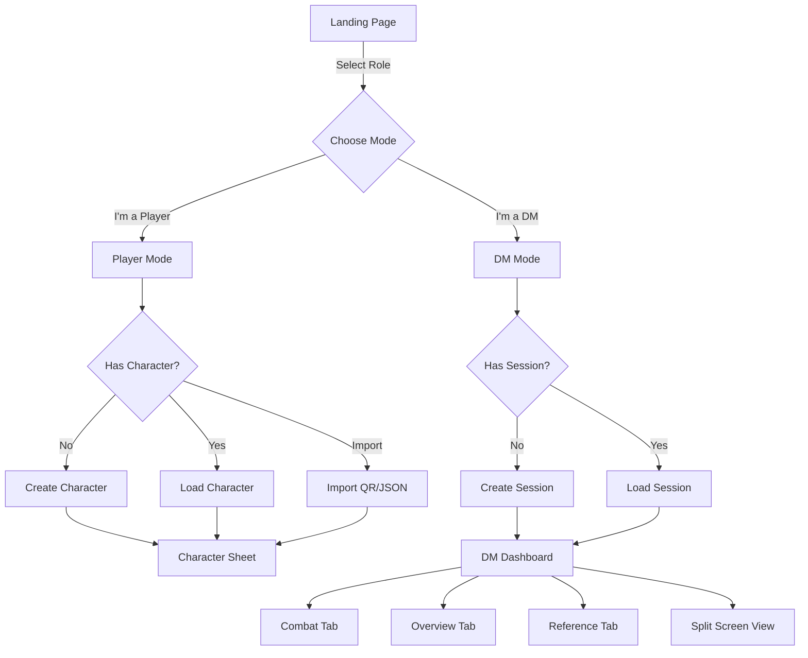
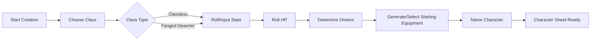
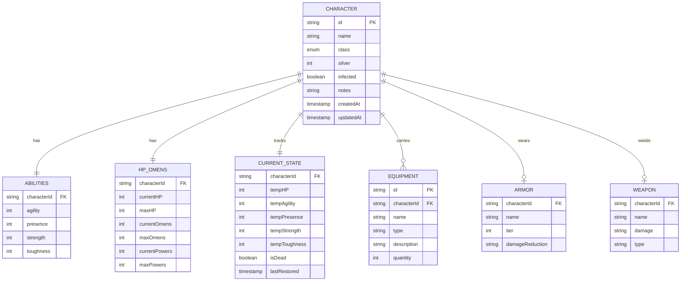
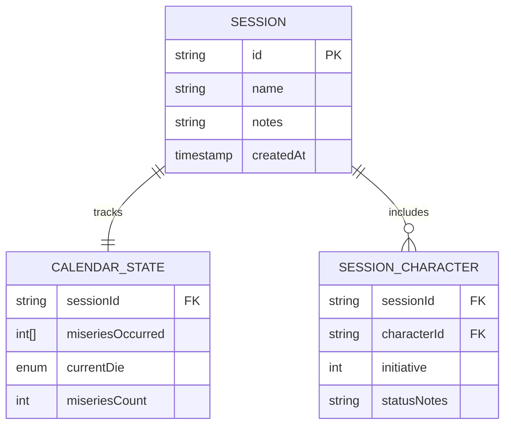
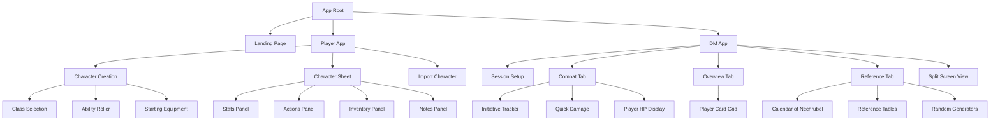
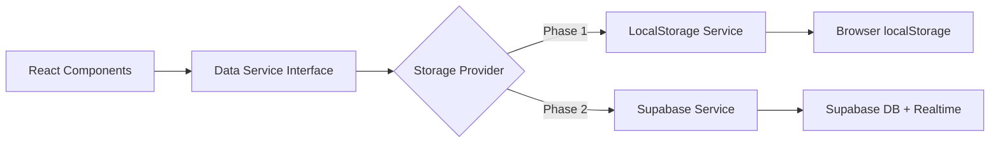
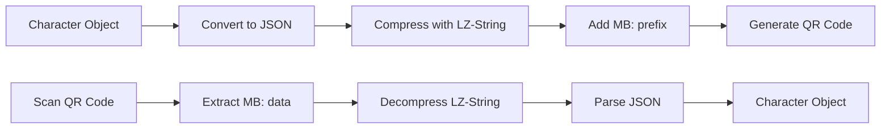
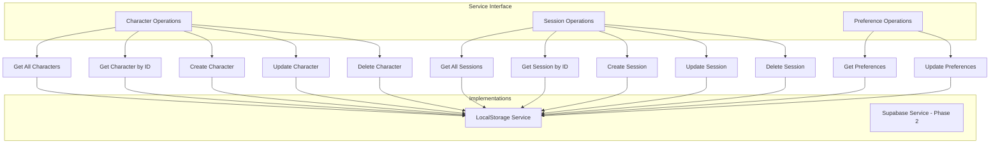

# Mörk Borg Manager - Core Design Document

## Project Overview

A static web application for managing Mörk Borg TTRPG gameplay with both player and DM tools. Built with React, Material-UI, and TypeScript. Initial version uses localStorage with future Supabase integration planned.

## Design Principles

1. **Offline-first**: Everything works without internet via localStorage
2. **Role-based**: Separate DM and Player interfaces
3. **Portable**: Character data export via JSON download and compressed QR codes
4. **Authentic**: Faithful to Mörk Borg rules and mechanics
5. **Extensible**: Built with data abstraction layer for future online sessions

---

## User Flows

### Primary User Journey



### Character Creation Flow



---

## Data Architecture

### Character Data Model



**Notes on Data Model:**
- **HP_OMENS**: Tracks both maximum values (set during character creation) and current values (modified during gameplay). Powers represent daily spell/ability usage.
- **CURRENT_STATE**: Persistent metadata for current session state. Temporary modifiers (temp stats, temp HP from effects), death status, and last rest timestamp for tracking power/omen restoration.
- **ABILITIES**: Base ability scores set at character creation. Temporary modifications stored in CURRENT_STATE.

### DM Session Data Model



### localStorage Schema

```typescript
{
  "user": {
    "lastRole": "player" | "dm",
    "preferences": {
      "theme": "light" | "dark",
      "autoRoll": boolean
    }
  },
  "characters": Character[],
  "sessions": DMSession[],
  "version": "1.0.0"
}
```

---

## Component Architecture

### Application Structure



### Data Service Abstraction Layer



---

## Feature Specifications

### Phase 1: LocalStorage (MVP)

#### Player Features

| Feature | Description | Priority |
|---------|-------------|----------|
| Character Creation | Wizard for creating classless or Fanged Deserter | P0 |
| Manual Ability Input | Allow players to input rolled stats | P0 |
| HP Tracking | Current/Max HP with +/- buttons | P0 |
| Omens Tracking | Current/Max omens display | P0 |
| Powers Tracking | Current/Max daily powers usage | P0 |
| Current State Persistence | Temp stats, status effects persist between sessions | P0 |
| Action Buttons | Melee/Ranged/Defend with modifiers shown | P0 |
| Optional Dice Roller | "Roll for me" button on actions | P1 |
| Inventory Management | List with soft capacity warnings (STR+8) | P1 |
| Status Effects | Infected checkbox, custom notes | P1 |
| Export Character | JSON download | P0 |
| QR Code Export | Compressed character data in QR | P1 |
| Import Character | JSON upload and QR scan | P1 |
| Bite Attack (Deserter) | Special action for Fanged Deserter class | P0 |

#### DM Features

| Feature | Description | Priority |
|---------|-------------|----------|
| Session Creation | Create and name sessions | P0 |
| Add Players | Link character IDs to session | P0 |
| Combat Tab | Initiative, HP overview, quick damage | P0 |
| Overview Tab | All player sheets in grid view | P1 |
| Reference Tab | Tables and calendar | P1 |
| Split Screen | Configurable dual-pane view | P2 |
| Calendar Tracker | Manual misery checkboxes, die tracker | P1 |
| Quick Damage | Apply damage to one or all players | P0 |
| Session Notes | Freeform text notes per session | P2 |

#### Shared Features

| Feature | Description | Priority |
|---------|-------------|----------|
| Role Switching | Quick toggle between DM/Player | P0 |
| Reference Tables | Core combat tables embedded | P1 |
| Random Generators | Character creation generators only | P1 |

### Phase 2: Supabase Integration (Future)

| Feature | Description | Priority |
|---------|-------------|----------|
| User Authentication | Supabase Auth with email/magic link | P0 |
| Online Sessions | Create shareable session rooms | P0 |
| Real-time Updates | WebSocket for live HP/status changes | P0 |
| Session Invites | QR code with session credentials | P1 |
| Player Permissions | DM can grant/revoke player access | P1 |
| Session History | Archive and restore past sessions | P2 |
| Shared Notes | Collaborative session notes | P2 |

---

## UI/UX Specifications

### Layout Structure

#### Player Character Sheet

```
┌─────────────────────────────────────────────────────────┐
│  [≡] Grittr the Cursed             [⬇️] [⚙️] [🔄 DM]    │
├─────────────┬───────────────────────────────────────────┤
│             │  ┌──────────────────────────────────┐     │
│   STATS     │  │  HP: 12/14      Omens: 2/2       │     │
│             │  │  [+] [-]        [Use Omen]       │     │
│  STR:  +2   │  │  Powers: 1/2    [Use Power]      │     │
│  AGI:  -1   │  └──────────────────────────────────┘     │
│  PRE:  +1   │                                            │
│  TGH:  +0   │  ┌─ ACTIONS ──────────────────────┐       │
│             │  │                                  │       │
│  CLASS:     │  │  🗡️ MELEE ATTACK                 │       │
│  Classless  │  │  Roll d20-1 vs DR12             │       │
│             │  │  [Show Info] [🎲 Roll for me]   │       │
│             │  │                                  │       │
│             │  │  🏹 RANGED ATTACK                │       │
│  INVENTORY  │  │  Roll d20+1 vs DR12             │       │
│  ─────────  │  │  [Show Info] [🎲 Roll for me]   │       │
│  Knife      │  │                                  │       │
│  Staff      │  │  🛡️ DEFEND                       │       │
│  Rope       │  │  Roll d20-1 vs DR12             │       │
│  Torch (3)  │  │  [Show Info] [🎲 Roll for me]   │       │
│  ...        │  └──────────────────────────────────┘     │
│             │                                            │
│  (6/10)     │  ☐ Infected   Silver: 45                  │
│  ⚠️ Near    │                                            │
│  capacity   │  [NOTES]                                   │
│             │  Found strange amulet in crypt...          │
└─────────────┴───────────────────────────────────────────┘
```

#### DM Combat Tab

```
┌─────────────────────────────────────────────────────────┐
│  [≡] Session: Tomb Crawl           [Combat|Overview|Ref]│
├─────────────────────────────────────────────────────────┤
│  INITIATIVE ORDER                                        │
│  ┌────────────────────────────────────────────────────┐ │
│  │ 1. Grittr (Player)          HP: 12/14  [+] [-]     │ │
│  │ 2. Goblin Squad             HP: 6/6                │ │
│  │ 3. Börda (Player)           HP: 8/10   [+] [-]     │ │
│  └────────────────────────────────────────────────────┘ │
│                                                          │
│  QUICK ACTIONS                                           │
│  ┌────────────────────────────────────────────────────┐ │
│  │ Deal Damage: [1] [2] [3] [4] [5] [6] [Custom]     │ │
│  │ To: [Grittr] [Börda] [All Players]                │ │
│  │                                      [Apply]       │ │
│  └────────────────────────────────────────────────────┘ │
│                                                          │
│  ENCOUNTER NOTES                                         │
│  Three goblins ambushed from shadows...                  │
└─────────────────────────────────────────────────────────┘
```

#### DM Reference Tab

```
┌─────────────────────────────────────────────────────────┐
│  [≡] Session: Tomb Crawl           [Combat|Overview|Ref]│
├─────────────────────────────────────────────────────────┤
│  📅 CALENDAR OF NECHRUBEL                                │
│  ┌────────────────────────────────────────────────────┐ │
│  │ Current Die: d100                                  │ │
│  │ [d100] [d20] [d10] [d6] [d2]                      │ │
│  │                                                    │ │
│  │ Miseries Occurred: 0/7                            │ │
│  │ ☐ 1:1  ☐ 1:2  ☐ 1:3  ☐ 1:4  ☐ 1:5  ☐ 1:6        │ │
│  │ ☐ 2:1  ☐ 2:2  ☐ 2:3  ☐ 2:4  ☐ 2:5  ☐ 2:6        │ │
│  │ ...                                               │ │
│  └────────────────────────────────────────────────────┘ │
│                                                          │
│  📊 REFERENCE TABLES                                     │
│  ┌────────────────────────────────────────────────────┐ │
│  │ DIFFICULTY RATINGS                                 │ │
│  │  6 - Incredibly simple                            │ │
│  │  8 - Routine                                      │ │
│  │ 10 - Pretty simple                                │ │
│  │ 12 - Normal                                       │ │
│  │ 14 - Difficult                                    │ │
│  │ 16 - Really hard                                  │ │
│  │ 18 - Should not be possible                       │ │
│  └────────────────────────────────────────────────────┘ │
└─────────────────────────────────────────────────────────┘
```

---

## Character Classes

### Classless Character

| Attribute | Value |
|-----------|-------|
| Abilities | Roll 3d6 for each (or manual input) |
| HP | Toughness + d8 |
| Omens | d2 (reroll after 6hr rest) |
| Starting Silver | 2d6 × 10 |
| Equipment | Standard starting equipment tables |
| Special | None |

### Fanged Deserter

| Attribute | Value |
|-----------|-------|
| Abilities | STR: 3d6+2, AGI: 3d6-1, PRE: 3d6-1 (or manual) |
| HP | Toughness + d10 |
| Omens | d2 (reroll after 6hr rest) |
| Starting Silver | 2d6 × 10 |
| Equipment | Standard + 1 special item (d6 table) |
| Special | **Bite Attack**: DR10 to attack, d6 damage, 1-2 on d6 enemy gets free attack |
| Limitation | **Illiterate**: Cannot understand scrolls (if start with one, reroll or use as toilet paper) |

---

## Random Generation Tables

### Character Creation Tables (MVP)

#### Name Generator (d6 × d8)

| d6 | d8=1 | d8=2 | d8=3 | d8=4 | d8=5 | d8=6 | d8=7 | d8=8 |
|----|------|------|------|------|------|------|------|------|
| 1 | Aerg-Tval | Agn | Arvant | Belsum | Belum | Brint | Börda | Daeru |
| 2 | Eldar | Felban | Gotven | Graft | Grin | Grittr | Haerü | Hargha |
| 3 | Harmug | Jotna | Karg | Karva | Katla | Keftar | Klort | Kratar |
| 4 | Kutz | Kvetin | Lygan | Margar | Merkari | Nagl | Niduk | Nifehl |
| 5 | Prügl | Qillnach | Risten | Svind | Theras | Therg | Torvul | Törn |
| 6 | Urm | Urvarg | Vagal | Vatan | Von | Vrakh | Vresi | Wemut |

#### Terrible Traits (d20, roll twice)

1. Endlessly aggravated
2. Inferiority complex
3. Problems with authority
4. Loud mouth
5. Cruel
6. Egocentric
7. Nihilistic
8. Prone to substance abuse
9. Conflicted
10. Shrewd
11. Vindictive
12. Cowardly
13. Lazy
14. Suspicious
15. Ruthless
16. Worried
17. Bitter
18. Deceitful
19. Wasteful
20. Arrogant

#### Broken Bodies (d20)

1. Staring manic gaze
2. Covered in blasphemous tattoos
3. Rotting face. Wears a mask
4. Lost three toes, limps
5. Starved: gaunt and pale
6. One hand replaced with rusting hook (d6 damage)
7. Decaying teeth
8. Hauntingly beautiful, unnervingly clean
9. Hands caked with sores
10. Cataracts slowly spreading in both eyes
11. Long tangled hair, at least one cockroach in residence
12. Broken, crushed ears
13. Juddering and stuttering from nerve damage or stress
14. Corpulent, ravenous, drooling
15. One hand lacks thumb and index finger, grips like a lobster
16. Red, swollen alcoholic's nose
17. Resting maniac face, making friends is hard
18. Chronic athlete's foot. Stinks
19. Recently slashed and stinking eye covered with a patch
20. Nails cracked and black, maybe about to drop off

#### Bad Habits (d20)

1. Obsessively collect small sharp stones
2. Won't use a blade without testing it on own flesh. Arms knitted with scars
3. Can't stop drinking once started
4. Gambling addict. Must bet every day
5. Cannot tolerate criticism of any kind. Results in rage and weeping
6. Unable to get to the point. Have never actually finished a story
7. Best friend is a skull. Carry it with you, tell it everything
8. Pick nose so deep it bleeds
9. Laugh hysterically at own jokes which are then explained in detail
10. Nihilist. Insist on telling everyone and explaining why
11. Inveterate bug eater
12. Stress response is aesthetic display. The worse things get the fancier you need to be
13. Permanent phlegm deposit in throat. Continuously cough, snort, spit and swallow
14. Pyromaniac
15. Consistently lose important items and forget vital facts
16. Insecure shit-stirrer. Will talk about whoever just left the room
17. Stutter when lying
18. Giggle insanely at the worst possible times
19. Whistle while trying to hide. Whistle when 5, 7, 9, 11 or 13 is rolled on d20
20. Make jewelry from the teeth of the dead

### Future Tables (Not MVP, Document Only)

#### Weather (d12)
#### Traps and Devilry (d12)
#### Corpse Plundering (d66)
#### Adventure Sparks (d100)
#### Troubling Tales (d20)
#### Random Encounters
#### Creature Stats
#### Occult Treasures (d10)
#### The Basilisks Demand (d20)

---

## Technical Implementation Notes

### QR Code Data Flow



**Format**: `MB:{compressed-base64-json}`
- **MB** = Mörk Borg identifier prefix
- Uses LZ-String compression library
- Base64 encoding for QR compatibility

### Data Service Operations



### Application Routes

| Path | Component | Description |
|------|-----------|-------------|
| `/` | Landing | Role selection page |
| `/player` | PlayerApp | Player mode root |
| `/player/create` | CharacterCreation | Character creation wizard |
| `/player/sheet/:id` | CharacterSheet | Main character sheet view |
| `/player/import` | ImportCharacter | QR/JSON import interface |
| `/dm` | DMApp | DM mode root |
| `/dm/session/new` | SessionSetup | Create new session |
| `/dm/session/:id/combat` | CombatTab | Combat management view |
| `/dm/session/:id/overview` | OverviewTab | All players overview |
| `/dm/session/:id/reference` | ReferenceTab | Tables and calendar |
| `/dm/session/:id/split` | SplitView | Configurable split screen |

---

## Testing Strategy

### Unit Tests
- Data service functions (CRUD operations)
- Character creation logic
- Damage calculation
- Dice rolling utilities
- QR compression/decompression

### Integration Tests
- Character creation flow
- Import/Export functionality
- DM session management
- LocalStorage persistence

### E2E Tests (Phase 2)
- Full player journey: create → play → export
- DM journey: create session → manage players → track combat
- Real-time updates via Supabase

---

## Future Enhancements (Post-MVP)

### Phase 2: Supabase Integration
- User authentication
- Online session rooms
- Real-time synchronization
- WebSocket for instant updates
- Session invites via QR code

### Phase 3: Advanced Features
- Combat automation (initiative rolling, damage calculation)
- Spell/Power tracking with descriptions
- Digital dice with 3D animations
- Creature stat blocks for DM
- Random dungeon generator
- Session replay/history
- Export to PDF character sheet
- Dark Mörk Borg theme with custom assets
- Sound effects and ambiance
- Multilingual support

### Phase 4: Community Features
- Public character gallery
- Share adventures/scenarios
- Custom class builder
- Homebrew content support
- Campaign arc tracking

---

## Glossary

| Term | Definition |
|------|------------|
| PC | Player Character |
| DM | Dungeon Master (Game Master) |
| DR | Difficulty Rating (target number for d20 tests) |
| HP | Hit Points |
| Omens | Luck/fate points that can modify rolls |
| Misery | Apocalyptic events in the Calendar of Nechrubel |
| Calendar of Nechrubel | Doom tracker for the end of the world |
| Powers | Magic spells from scrolls |
| Infected | Status effect that prevents healing |

---

## References

- Mörk Borg Bare Bones Edition rulebook (included in project)
- Material-UI Component Documentation
- React Router v6 Documentation
- TypeScript Handbook
- Supabase Documentation (for Phase 2)

---

**Document Version**: 1.0
**Last Updated**: 2025
**Status**: Planning Complete - Ready for Implementation
